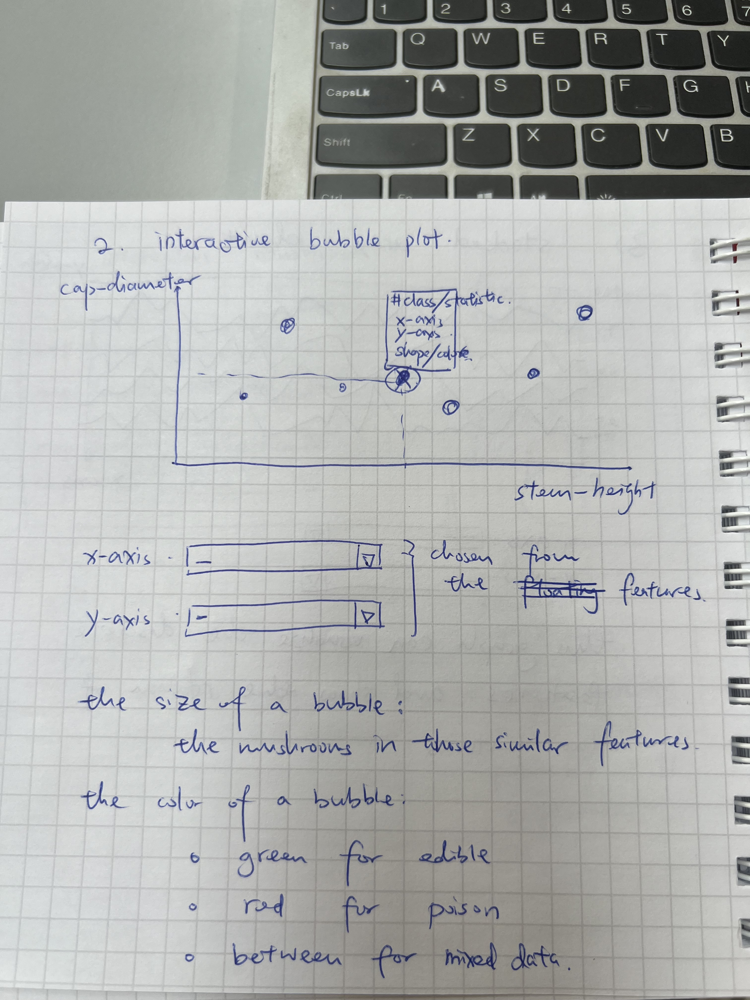
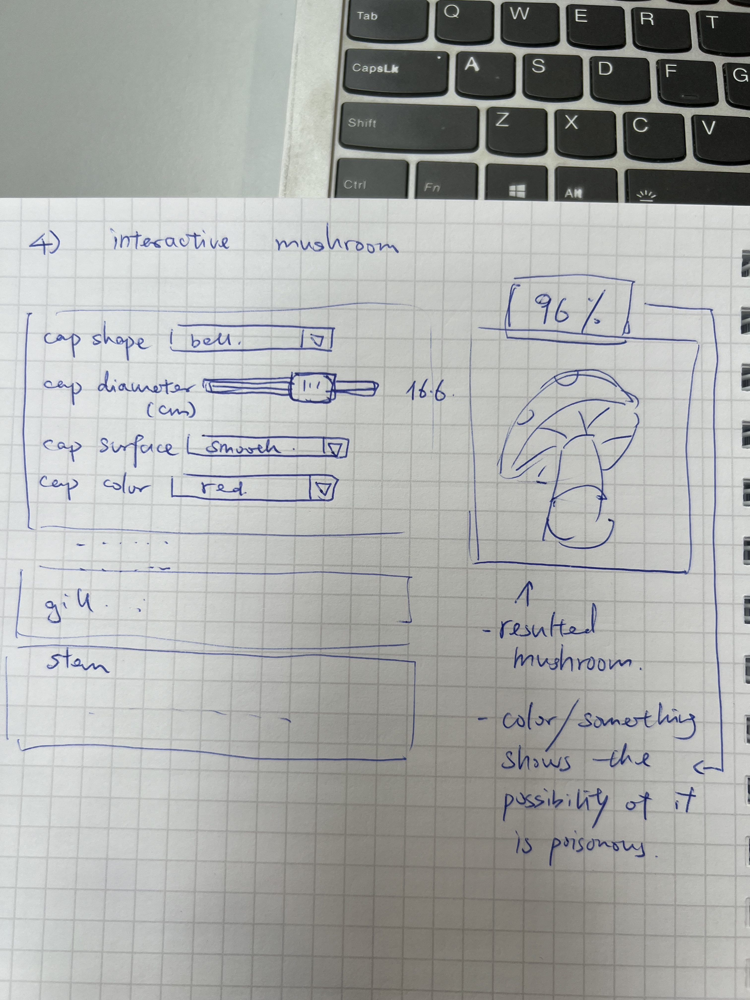
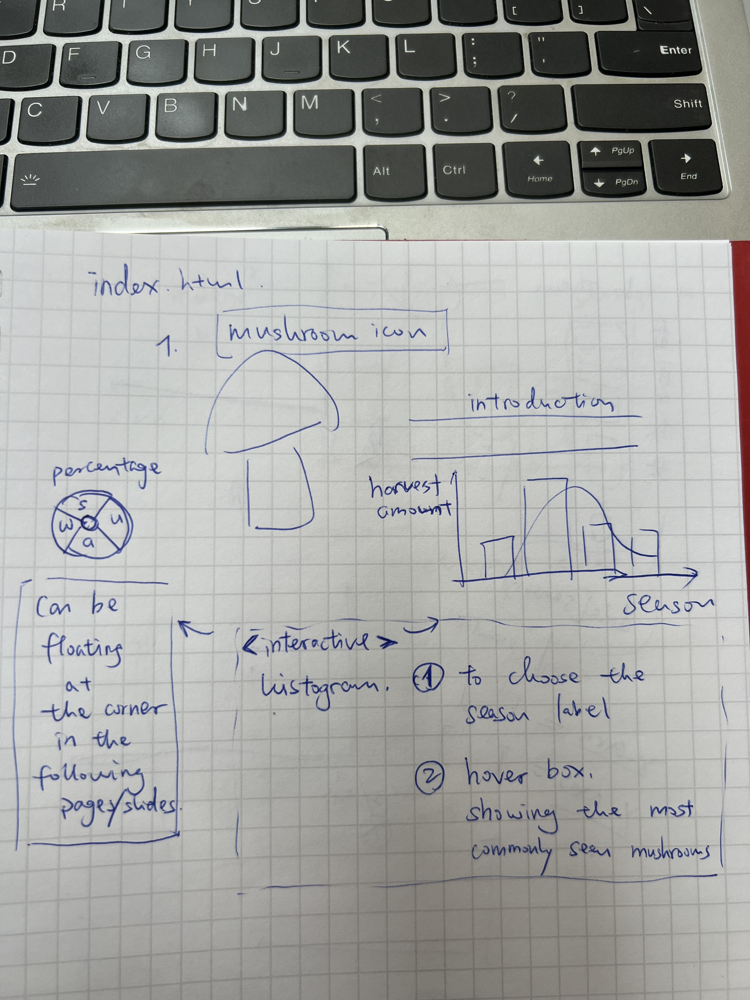
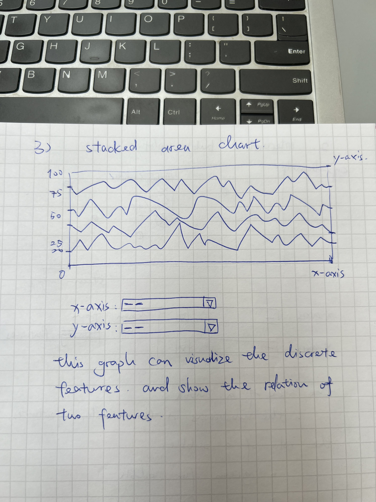

# Two A4 pages describing the project goal

## Sketches of Visualizations
1. Put the dataset visualization on the website (allow users to choose axis(1-2 feature, poisonous is always chosen), maybe the color of points to show the edibility)
2. Realize a little widget which illustrate the mushroom in real-time according to user's input (choose shape, slides size, etc.)

### Interactive Scatter Plot:

Description: Users can select different mushroom features from dropdown menus to visualize how these attributes correlate with mushroom edibility.

Sketch: Include a simple diagram showing a scatter plot with dropdown options for different features.

Sketch: Include an interface with several bars allowing users to select mushrooms with desired features.

### Distribution Charts:

Description: Histograms or bar charts that display the distribution of mushrooms based on selected features like color, habitat, etc., segmented by edibility.

Sketch: Depict histograms segmented by color with controls for switching the feature.

Sketch: A stacked area chart to visualize discrete features.

### Geographical Map:

Description: A map showing locations where different types of mushrooms are commonly found, with filters for edibility and type.

Sketch: Map visualization with filters and hover-over effects for detailed information

## Tools and Resources

1. **Data Handling and Preprocessing**: Python, Pandas

2. **Data Visualization**: D3.js for interactive web visualizations, Python (Matplotlib, Seaborn) for preliminary data exploration

3. **Web Development**: HTML, CSS, JavaScript for front-end; Flask/Django for backend if necessary

4. **Hosting/Deployment**: GitHub Pages or Heroku

## Relevant Lectures

1. JavaScript and D3.js: Learned basic JavaScript syntax and the D3.js framework for visualizing data.

2. Data: We pre-processed the gathered data using techniques taught in this lecture.

3. Interactions, Perception Colors, Mark, Channels, Do and Don't in Viz, and Designing Viz: The colors of the graphs were chosen based on the lectures on Perception, Color, and Do and Don't in Viz to enhance interpretability. Additionally, geometric distortion was employed to reveal more details about the distribution of mushrooms and help readers grasp the information more easily.

4. Maps and Graph Viz: With data collected from mushrooms in Switzerland and its vicinity, we aim to create maps and graphs illustrating the relationship between features such as edibility, color, size, shape, and geographical distribution. To achieve this successfully, we will utilize the knowledge from the lectures on Maps and Graph Viz.

5. Tabular data: Tabular data provides readers with more intuitive feedback on the data. For example, a star plot can demonstrate the toxicity of mushrooms more concisely.

6. Storytelling: We are going to add background stories for mushrooms to attract underlying readers. 

## Project Breakdown

### Core Visualization (Minimal Viable Product)
A basic interactive scatter plot that allows users to select features and visualize the correlation with mushroom edibility.
(Also need to show there's a strong correlation between the mushrooms' appearance and their toxicity)

Distribution charts showing the basic statistical breakdown of mushroom features like color and shape.

### Extra Ideas (Enhancements)

Advanced filtering options in the scatter plot and distribution charts to allow users to drill down into specific subcategories.
(Visualize the filter with a mushroom painted aside, to give the user's a intuitive feel for the look of the mushroom.)

Integration of a geographical map that adds an additional layer of data visualization showing the natural habitats of different mushrooms.

# Functional project prototype review
Prototype Requirements
- A basic website layout running locally or hosted online.
- Initial implementations of the scatter plot and distribution charts using dummy or preliminary real data.
- Basic navigation and user interface elements allowing users to interact with the visualizations.

